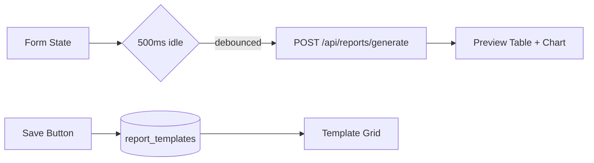

# Reporting & Analytics — Design Spec

**Date:** 2026-06-15
**Status:** Draft
**Author:** opencode-1

## Overview

Add a full reporting and analytics subsystem to Leduc Receipt Pro, enabling users to
generate pre-built and custom reports from their receipt data, visualize results as
charts and tables, export to CSV/PDF, and schedule recurring delivery via email.

## Architecture

```
┌─────────────────────────────────────────────────────────────┐
│  src/components/reports/                                    │
│  ├── ReportsPage.tsx          ← Main tab with routing        │
│  ├── ReportTemplateCard.tsx   ← Template card in grid       │
│  ├── ReportViewer.tsx         ← Table + chart + export       │
│  ├── ReportFilters.tsx        ← Date range + filters         │
│  ├── CustomReportBuilder.tsx  ← Form-based builder (P2)     │
│  └── ScheduleManager.tsx      ← Schedule CRUD (P3)          │
│                                                              │
│  src/app/api/reports/                                        │
│  ├── templates/route.ts       ← GET — list templates        │
│  ├── generate/route.ts        ← POST — run report query     │
│  └── export/route.ts          ← POST — download CSV/PDF     │
│                                                              │
│  src/lib/services/reports.ts  ← Report engine + types       │
│                                                              │
│  src/hooks/useReports.ts      ← React Query hooks           │
│                                                              │
│  supabase/migrations/                                        │
│  ├── report_templates.sql     ← custom templates table      │
│  └── report_schedules.sql     ← scheduled reports table     │
└─────────────────────────────────────────────────────────────┘
```

### Key Principles

- **Config-driven**: Every report (pre-built or custom) is a `ReportConfig` object
  serialized as JSON. The engine queries or renders based solely on config.
- **Single aggregation query**: One SQL query per report — no N+1, no client-side
  aggregation. Metrics are computed in Postgres.
- **Tenant isolation**: Every query filters by `org_id` via `getOrgIdString()`.
- **Reuse existing infrastructure**: auth, rate limiting, Zod validation, React Query,
  Recharts, PDF generation, error boundaries, skeletons.

## Data Model

```typescript
// === src/lib/services/reports.ts ===

type Metric =
  | 'total_spend'      // sum(total_amount)
  | 'receipt_count'    // count(*)
  | 'avg_receipt'      // avg(total_amount)
  | 'tax_total'        // sum(tax_amount + coalesce(pst_amount, 0))
  | 'max_receipt'      // max(total_amount)

type Dimension =
  | 'category'         // category
  | 'vendor'           // vendor_name
  | 'project'          // project_id → join projects(name)
  | 'business_unit'    // business_unit_id → join business_units(name)
  | 'month'            // to_char(transaction_date, 'YYYY-MM')
  | 'approval_status'  // approval_status

type DatePreset =
  | 'this_month' | 'last_month'
  | 'this_quarter' | 'last_quarter'
  | 'this_year' | 'last_year'
  | 'all_time' | 'custom'

interface ReportConfig {
  metrics: Metric[]
  dimensions: Dimension[]
  groupBy: Dimension | null
  datePreset: DatePreset
  customDateRange?: { start: string; end: string }
  filters?: {
    categories?: string[]
    vendors?: string[]
    projects?: string[]
    businessUnits?: string[]
    approvalStatus?: string[]
    minAmount?: number
    maxAmount?: number
  }
}

interface ReportResult {
  config: ReportConfig
  rows: Record<string, number | string>[]
  totals: Record<string, number>
  generatedAt: string
}

interface ReportTemplate {
  id: string
  name: string
  description: string
  icon: string
  type: 'builtin' | 'custom'
  config: ReportConfig
  defaultExport: 'csv' | 'pdf'
}
```

### Database: `report_templates`

```sql
CREATE TABLE report_templates (
  id UUID PRIMARY KEY DEFAULT gen_random_uuid(),
  org_id UUID NOT NULL REFERENCES organizations(id) ON DELETE CASCADE,
  name TEXT NOT NULL,
  config JSONB NOT NULL,
  created_by UUID NOT NULL REFERENCES auth.users(id),
  created_at TIMESTAMPTZ DEFAULT now(),
  updated_at TIMESTAMPTZ DEFAULT now()
);

-- RLS: org_id = get_org_for_user(auth.uid())
```

### Database: `report_schedules` (Phase 3)

```sql
CREATE TABLE report_schedules (
  id UUID PRIMARY KEY DEFAULT gen_random_uuid(),
  org_id UUID NOT NULL REFERENCES organizations(id) ON DELETE CASCADE,
  report_config JSONB NOT NULL,
  frequency TEXT NOT NULL CHECK (frequency IN ('weekly', 'monthly', 'quarterly')),
  day_of_week INT CHECK (day_of_week BETWEEN 0 AND 6),
  day_of_month INT CHECK (day_of_month BETWEEN 1 AND 31),
  time_of_day TIME NOT NULL DEFAULT '08:00',
  email_to TEXT NOT NULL,
  format TEXT NOT NULL DEFAULT 'pdf' CHECK (format IN ('pdf', 'csv')),
  next_run_at TIMESTAMPTZ NOT NULL,
  is_active BOOLEAN DEFAULT true,
  created_by UUID NOT NULL REFERENCES auth.users(id),
  created_at TIMESTAMPTZ DEFAULT now(),
  updated_at TIMESTAMPTZ DEFAULT now()
);

-- RLS: org_id = get_org_for_user(auth.uid())
```

## Phase 1 — Report Engine + Pre-built Reports

### Report Engine (`src/lib/services/reports.ts`)

The core function `generateReport(config)`:

1. **Validates** `config` with Zod schema
2. **Resolves date range** from `datePreset` (or `customDateRange`)
3. **Builds aggregation query** dynamically:
   - SELECT: chosen metrics as SQL aggregates
   - FROM: receipts (tenant-filtered by `org_id`)
   - WHERE: date range + optional filters
   - GROUP BY: chosen dimension (or no group for totals-only)
   - ORDER BY: metric with largest value (descending)
4. **Executes** via Supabase JS SDK (raw SQL via `.rpc()` or `.from('receipts').select()`)
5. **Returns** `ReportResult` with rows, totals, and metadata

### API Routes

| Route | Method | Description |
|-------|--------|-------------|
| `/api/reports/templates` | GET | Returns list of 5 built-in + any custom templates for org |
| `/api/reports/generate` | POST | Accepts `ReportConfig`, returns `ReportResult` |
| `/api/reports/export` | POST | Accepts `ReportConfig` + format, streams file download |

All routes use:
- `withRateLimit()` — 30 req/min
- Zod validation on request body
- Generic error responses (no `err.message` leak)
- `getOrgIdString()` for tenant isolation

### Five Pre-built Templates

| Template | Icon | Group By | Metrics | Default Period |
|----------|------|----------|---------|----------------|
| GST/HST Claim Summary | FileText | none (single row) | tax_total, receipt_count, vendor_count | Last quarter |
| Vendor Spend Analysis | Building2 | vendor | total_spend, receipt_count, avg_receipt | This year |
| Category Breakdown | PieChart | category | total_spend, receipt_count, tax_total | This year |
| Monthly Spend Trends | TrendingUp | month | total_spend, receipt_count, avg_receipt | This year |
| Annual Comparison | Calendar | month | total_spend, receipt_count | Last 2 years |

### UI Components

**ReportsPage.tsx** — tab content container
- Tabs: "Library" (templates) | "Scheduled" (P3)
- Header: title + "Custom Report" button (P2)
- Template grid: cards with icon, name, description, "Generate" button

**ReportTemplateCard.tsx** — individual card in the grid
- Icon, name, 1-line description
- "Generate" button → opens ReportViewer in a drawer
- "Schedule" button (P3)
- Selected state with champagne border accent

**ReportViewer.tsx** — results view
- Appears as a drawer or inline panel after generation
- Top bar: report name, date range badge, export buttons (CSV/PDF)
- Chart: appropriate Recharts viz (bar for categories, line for time series, donut for breakdown)
- Table: scrollable data table with alternating row stripes, sorted by primary metric
- Totals row at bottom in bold

**ReportFilters.tsx** — filter bar
- Date preset dropdown (this month → custom range picker)
- Conditional: category multi-select, vendor multi-select (populated from org's data)
- "Run Report" button

## Phase 2 — Custom Report Builder

**Not overengineered.** Form-based, no drag-and-drop.

### UI Flow

1. User clicks "Custom Report" from the Reports page
2. Two-step form:
   - **Step 1**: Report name + metric checkboxes
   - **Step 2**: Group by dropdown + optional filter dropdowns
3. **Live preview** updates 500ms after last change (debounced `generateReport` call)
4. "Save as Template" button persists to `report_templates` table
5. Saved templates appear in the template grid with a "Custom" badge

### Form Fields

| Field | Type | Notes |
|-------|------|-------|
| Name | Text input | Required |
| Metrics | Checkbox group (≥1) | Spend, Count, Avg, Tax, Max |
| Group By | Single select dropdown | Category, Vendor, Project, Business Unit, Month, Approval Status — or "None" for single total |
| Date Preset | Dropdown | All presets + custom range |
| Category Filter | Multi-select | Populated from org's distinct categories |
| Vendor Filter | Multi-select | Populated from org's distinct vendors |
| Project Filter | Multi-select | Populated from org's projects |

### Data Flow



## Phase 3 — Scheduled Reports

### Schedule Creation

Each report (pre-built or custom) has a "Schedule" action that opens a dialog:

| Field | Type | Notes |
|-------|------|-------|
| Frequency | Radio: Weekly/Monthly/Quarterly | |
| Day | Dropdown | Day of week (weekly) or day of month (monthly) |
| Time | Time picker | Default 08:00 |
| Email | Email input | Where to send; defaults to user's email |
| Format | Toggle: PDF/CSV | Default PDF |

### Scheduler Implementation

Two options, with Option A preferred:

**Option A — Supabase pg_cron (preferred):**
- A Supabase Edge Function runs every hour
- Queries `report_schedules` where `next_run_at <= now()` and `is_active = true`
- Generates the report → renders to format → emails via Supabase built-in email
- Updates `next_run_at` to next occurrence

**Option B — Vercel Cron:**
- `vercel.json` with cron job hitting an internal API route
- Same logic as Option A

### Schedule Management UI

- "Scheduled" tab in ReportsPage
- Cards showing: report name, frequency, next run, email, status toggle
- Delete with confirmation dialog (uses existing AlertDialog)

## Cross-cutting Concerns

### Error Handling
- API routes: Zod validation error → 400 with field-level messages
- Engine: invalid config → thrown `ReportError` with user-friendly message
- UI: ErrorBoundary per component, toast for transient failures
- Export: stream errors handled gracefully, partial file discarded

### Loading States
- Template grid: `PremiumSkeletons` (card skeleton)
- Report results: `PremiumSkeletons` (table skeleton) during generation
- Export: download spinner with progress indicator for large reports

### Accessibility
- All chart areas have `aria-label` and `role="img"`
- Tables use proper `<th>`, `<caption>`, `scope`
- Filter dropdowns use `aria-labelledby`
- Keyboard navigation through all form controls

### Performance
- Report generation is a single aggregation query — no N+1
- Date range indexed on `receipts.transaction_date` (index exists from setup.sql)
- Debounced preview avoids rapid-fire queries in custom builder
- React Query `staleTime: 30s` for template list, no caching on report results

### Security
- `org_id` filtering on every query via `getOrgIdString()`
- RLS policies on `report_templates` and `report_schedules`
- Rate limiting on all report API routes
- Zod validation on all config inputs

## Implementation Order

1. **Phase 1: Foundation** — `reports.ts` engine, DB tables, Zod schemas, types
2. **Phase 1: Backend** — 3 API routes (templates, generate, export)
3. **Phase 1: UI** — ReportsPage template grid, ReportViewer, ReportFilters
4. **Phase 1: Pre-built templates** — Register 5 templates in the engine
5. **Phase 2** — Custom report builder form + save-as-template
6. **Phase 3** — Schedule dialog + Schedules page + cron worker
7. **Integration** — Wire into main page.tsx as a new tab (or sub-tab under "more")
8. **Tests** — Unit tests for engine + API route integration tests + E2E

## Files Changed

### New files:
- `src/lib/services/reports.ts` — Report engine, types, templates
- `src/hooks/useReports.ts` — React Query hooks
- `src/app/api/reports/templates/route.ts` — GET templates
- `src/app/api/reports/generate/route.ts` — POST generate
- `src/app/api/reports/export/route.ts` — POST export
- `src/components/reports/ReportsPage.tsx`
- `src/components/reports/ReportTemplateCard.tsx`
- `src/components/reports/ReportViewer.tsx`
- `src/components/reports/ReportFilters.tsx`
- `src/components/reports/CustomReportBuilder.tsx` (Phase 2)
- `src/components/reports/ScheduleManager.tsx` (Phase 3)
- `supabase/migrations/report_templates.sql`
- `supabase/migrations/report_schedules.sql`

### Modified files:
- `src/lib/store.ts` — Add `'reports'` to Tab type
- `src/app/page.tsx` — Wire reports tab with dynamic import
- `src/components/layout/Sidebar.tsx` — Add Reports nav item
- `src/components/layout/MobileNav.tsx` — Add Reports to "More" sheet (or as tab)
- `src/components/layout/MoreSheet.tsx` — Add Reports link
